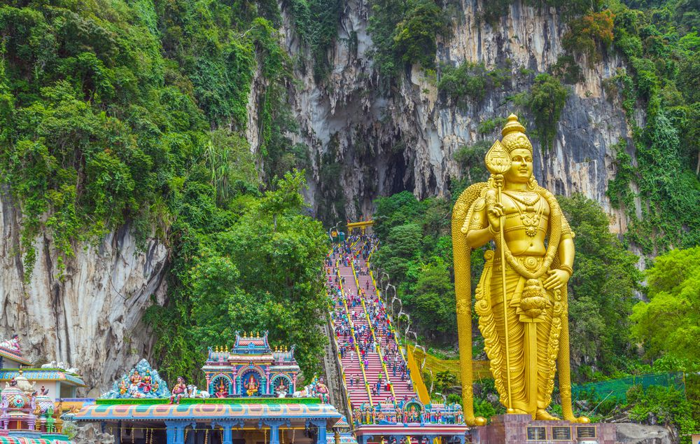

# File for brainstorming and generally just writing down ideas
# Timetable

* Until saturday: Tokyo
* Sunday morning: Supertrain too Fuji San
    + Find hostell
    + Grabs for the grams
    + Chill in hotspring, with view of Mount Fuji (sunset 1827)
    + Beer in hand (alternatively sake)
* Monday morning: Supertrain to Kyoto
    + Visit castle
    + 
* 

# Calendar

Date | Day | Place
---|----|--------
4 | Saturday| Tokyo
5 | Sunday| Tokyo -> Fuji
6 | Monday| Fuji -> Kyoto
7 | Tuesday|
8 | Wednesday| -> Vietnam, Brownian motion with scooter
9 | Thursday| Ha long bay?. 
10 | Friday| ???
11 | Saturday| Alex's plane leaves 01.15 (GMT+7) to Seoul, godspeed.
12 | Sunday|
13 | Monday|
14 | Tuesday|
15 | Wednesday|
16 | Thursday|
17 | Friday|
18 | Saturday| Norway in the night
19 | Sunday| Norway

# Sicko idea from Henko
Plane to Seoul after Japan, together with Alex, before Vietnam.

# Japan
We have hostell in Tokyo until Sunday.

Places in Japan we want to wisit:

## Fuji san (Mount fuji)

* Hotspring

## Kyoto -- Castle

Things to to:

* Travel by supertrain

# Vietnam
## Places 
- Ha Long bay
The sick green mountains surrounded by turquoise water.

- Sapa, Haoung Su Phi, Mu Chag Chai (rice fields)

- Hoi an (suggestion from Dompi)

- Ninh binh /Tam coc (suggestion from Dompi)

## Activities
 - Deep water solo

# Malaysia
## Places 
- The stairs

# Random
## Random idea list:
 - Rent scooters

# Quotes
> "Det er like mye å gjøre der som alle andre land" 
> -Henko om Korea

> "Når du flyr vestoer, flyr du bakover i tid"
> -Henko om fly til Norge
